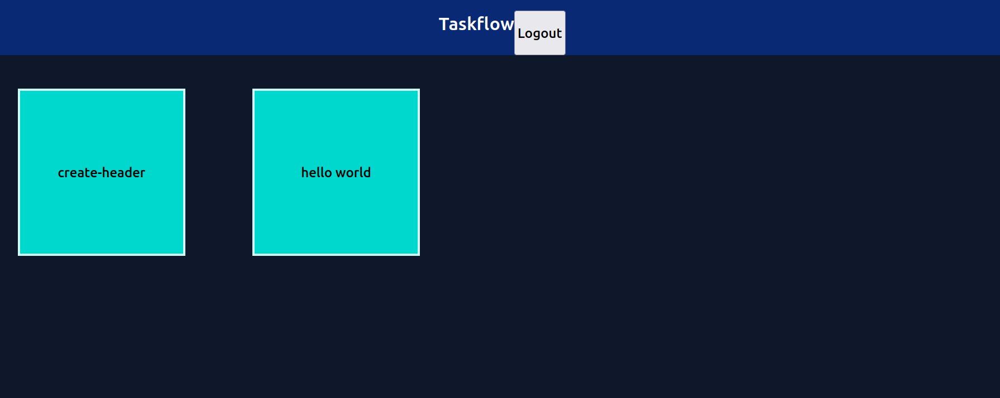
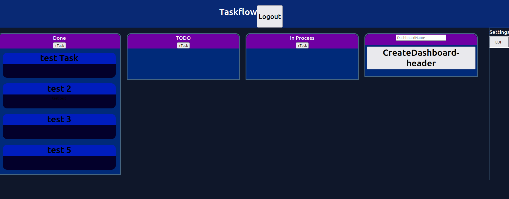
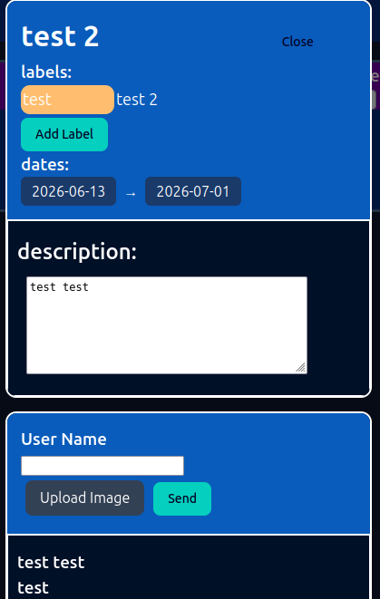
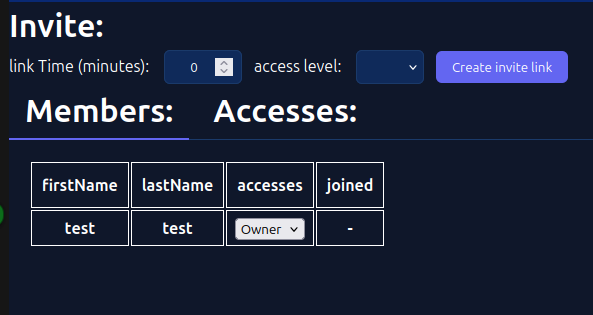
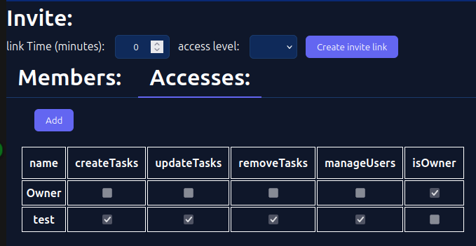
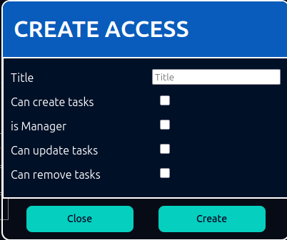

# Taskflow
## Description
A project management tool for organizing tasks across customized dashboards with team collaboration features.
## Stack
**Frontend:** React, TypeScript, Redux Toolkit, dnd-kit, i18n  
**Backend:** ASP.NET Core, Entity Framework, JWT, AutoMapper, Swagge  
**Infrastructure:** Docker  
## Run
```
docker-compose -f dockerCompose/docker-compose.yml up
```
## Screens






